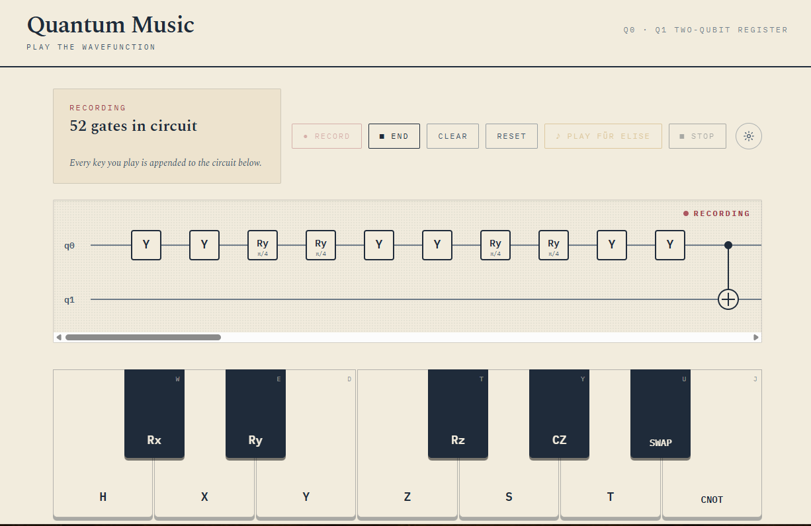
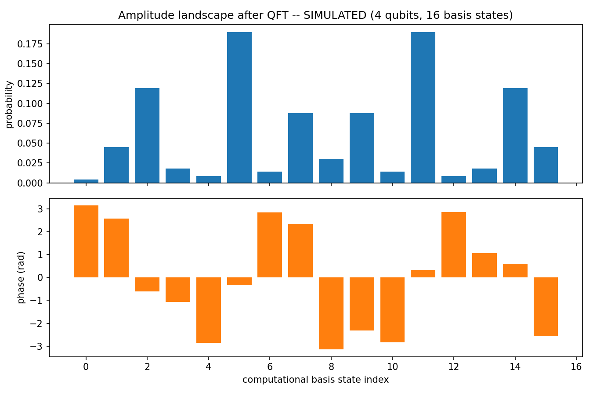

# QuantumResearch

Small proof-of-concept scripts exploring quantum computing, mostly with
[Cirq](https://quantumai.google/cirq), Google's Python framework for building and simulating
quantum circuits.

## ⭐ [`quantum_music/`](#quantum_music) — play the wavefunction



The flagship of this repo. A playable piano keyboard where every key *is* a quantum gate — press
one and you hear a tone and watch the gate land on a live circuit diagram in real time. It's the
most immediate, tactile way in here to feel what a quantum circuit actually is: not a diagram you
read, but one you play. See the [full writeup below](#quantum_music) for how it works and how to
run it.

## Contents

- [`quantum_music/`](#quantum_music) — a playable piano that builds a quantum circuit as you play
- [`quantum_encrypt.py`](#quantum_encryptpy) — quantum random number generator one-time pad
- [`quantum_morse/quantum_morse.py`](#quantum_morsequantum_morsepy) — Morse code over qubits
- [`quantum_gravity/`](#quantum_gravity) — emergent bulk geometry from a toy HaPPY code
- [`path_visualizer/`](#path_visualizer) — Feynman path-integral field with a learned world model
- [`quantum_prime_gaps/`](#quantum_prime_gaps) — prime gap sequence angle-encoded onto qubits,
  read out through a QFT

## Prerequisites

- **Python 3.10+** — for `quantum_encrypt.py`, `quantum_morse/`, `quantum_prime_gaps/`, and the
  backends of `quantum_gravity/` and `path_visualizer/`.
- **Node.js 18+ with npm** — needed for `quantum_music/` and the frontends of `quantum_gravity/`
  and `path_visualizer/`; the plain Python scripts don't touch it.

## Setup

This installs the dependencies for the plain scripts below
(`quantum_encrypt.py`, `quantum_morse/`, `quantum_prime_gaps/`):

```bash
python3 -m venv .venv
./.venv/bin/pip install -r requirements.txt
```

`quantum_gravity/` and `path_visualizer/` are self-contained and don't use this venv — each has
its own `run.sh` that creates its own backend venv and installs its own frontend dependencies on
first run, as described in their sections below.

## `quantum_music/`

A playable piano keyboard, one octave, where each of the twelve keys is bound to a quantum gate
instead of just a note. Press a key and two things happen at once: an audible sine-wave tone
plays (standard C4–B4 piano frequencies via the Web Audio API), and its gate shows up on a live
circuit diagram over a two-qubit register, `q0` and `q1`. White keys carry the classic gate set —
`H X Y Z S T CNOT`; black keys carry rotations and a second entangling pair — `Rx Ry Rz CZ SWAP`.
Single-qubit gates land on `q0` (except `Rz`, which targets `q1`, so both wires get some traffic),
and `CNOT` / `CZ` / `SWAP` span both.

There are two modes. **Freeplay** is instant gratification — every keypress plays its tone and
pops up an info card for that one gate (symbol, name, description, target qubit), with nothing
accumulating. **Record** turns the piano into a composer: press Record, and every key you play is
both heard and appended to the circuit diagram, gate after gate in standard circuit notation
(control dots, `⊕` targets, `×` swaps) rendered live in SVG; press End to lock the finished
circuit in place. A gear-icon Settings panel lets you remap any of the twelve keys to any keyboard
key, in case the default `A S D F G H J` / `W E T Y U` layout doesn't fit your hands.

No backend, no external UI libraries — just React, Tailwind, and the Web Audio API.

```bash
cd quantum_music
npm install
npm run dev
```

Then open the URL Vite prints (typically http://localhost:5173) and start playing — either by
clicking keys or by typing on the keyboard mapping shown in the corner of each key.

## `quantum_encrypt.py`

Real encryption: a one-time pad keyed by a quantum random number generator. Hadamard-superposed
qubits are measured (in batches, to keep each simulated state vector small) to produce a key of
genuinely random bits, which is then XORed with the message's binary form.

```bash
./.venv/bin/python quantum_encrypt.py
```

It also decrypts the ciphertext with a second, different random key to show the result is
garbage — a one-time pad is only secure if the exact same key is reused for decryption, is truly
random, is the same length as the message, is never reused, and stays secret.

Sample output (the key and ciphertext are freshly random each run):

```
Message: 'hello hilbert'

Quantum-generated key: 01000101101001111111000111110000010100010101100011111101001110011101010101001011001111101011010000001000
Ciphertext (bits):     00101101110000101001110110011100001111100111100010010101010100001011100100101001010110111100011001111100
Ciphertext (hex):      2dc29d9c3e789550b9295bc67c

Decrypted with correct key: 'hello hilbert'
Decrypted with wrong key:   '\x96\x11\x17F\x81M\x15\x8f+\x10`o\x84'
```

## `quantum_morse/quantum_morse.py`

A Morse code device simulated on qubits. A message is translated to Morse, then to an ITU-timed
pulse train (dot = 1 unit on, dash = 3, gaps of 1/3/7 units for symbol/letter/word boundaries).
Each pulse bit is "transmitted" by writing it onto a qubit with an `X` gate and reading it back
via measurement (batched, to keep each simulated state vector small), then decoded back through
Morse to text.

```bash
./.venv/bin/python quantum_morse/quantum_morse.py "your message here"
```

Run with no argument to instead run through a set of built-in example messages
(`SOS HELP`, `HELLO`, `CQ DE W1AW 73`, `A`).

Sample output:

```
$ ./.venv/bin/python quantum_morse/quantum_morse.py "HELLO WORLD"

Message: 'HELLO WORLD'

Morse:       .... . .-.. .-.. --- / .-- --- .-. .-.. -..
Pulse train: 101010100010001011101010001011101010001110111011100000001011101110001110111011100010111010001011101010001110101

Read back from qubits: 101010100010001011101010001011101010001110111011100000001011101110001110111011100010111010001011101010001110101
Matches sent pulses:   True

Decoded Morse: .... . .-.. .-.. --- / .-- --- .-. .-.. -..
Decoded text:  'HELLO WORLD'
```

## `quantum_prime_gaps/`



A quantum spectral analysis of the prime gap sequence, built on [Qiskit](https://www.ibm.com/quantum/qiskit).
The first 50 primes are hardcoded and their 49 consecutive gaps (2, 1, 2, 2, 4, 2, ...) are
normalized to `[0, pi]` rotation angles. A small qubit register (7 qubits by default, shared with
the prediction pathway below via the same `--qubits` flag) is loaded
with those angles via **data re-uploading** (Perez-Salinas et al., 2020): the 49-value sequence is
split into chunks the size of the register, each chunk is `Ry`-rotated onto the qubits, and a ring
of `CX` gates entangles the register before the next chunk lands — the standard way to angle-encode
a classical sequence longer than the available qubits into a fixed-size register. A Quantum Fourier
Transform is then applied to the fully loaded register, and the resulting statevector's Born-rule
probabilities are read out as the "amplitude landscape" — the frequency portrait of the gap wave.

Two hard checks run before anything is plotted or a qubit touches real hardware: the 50 hardcoded
primes are independently re-derived with a sieve, and the entire circuit (rotations, entanglers,
QFT) is separately re-implemented as dense linear algebra in plain numpy — with no dependency on
Qiskit's simulator — and asserted to match Qiskit's own `Statevector` output to floating-point
precision. A softer, exploratory check compares the real sequence's amplitude-landscape entropy
against 50 random shuffles of the same 49 gap values, since re-uploading is order-sensitive; it's
reported, not asserted, since a single ordering isn't guaranteed to beat a shuffle average.

```bash
./.venv/bin/python quantum_prime_gaps/quantum_prime_gaps.py
```

Writes three plots to `quantum_prime_gaps/output/`, each tagged `_sim` since they come from the
exact statevector simulation: the raw `gap_sequence.png`, `amplitude_landscape_sim.png` (probability
and phase per basis state), and `frequency_portrait_sim.png`, re-centered around zero the way a
classical FFT magnitude spectrum is usually drawn. `--qubits N` changes the register size (and
therefore how many gap values land in each re-upload chunk).

`--hardware` additionally runs the same circuit on a real IBM Quantum backend via
`qiskit-ibm-runtime`'s Sampler primitive — pick one with `--backend NAME` or let it default to the
least-busy device — and writes a fourth plot, `amplitude_landscape_quantum_<backend>.png`, overlaying
the real measured probabilities against the simulated ones so noise is visible directly. Hardware
only returns measurement counts, not the full complex statevector, so this overlay compares
probabilities only — there's no hardware equivalent of the phase panel in the `_sim` plot. (As of
the prediction-pathway rewrite below, `--hardware` also submits the prediction circuit and writes a
second overlay, `amplitude_landscape_prediction_quantum_<backend>.png`, with the same
probabilities-only caveat.)

The amplitude landscape's probability bars are symmetric about the middle index (`P(k) ~= P(dim-k)`)
because the pre-QFT state only ever goes through `Ry` and `CX` gates — no complex phases — so it's
entirely real-valued, and a QFT of any real-valued input is symmetric that way as a general fact.
With `--qubits 7` (128 basis states, 31 of which are prime), some peaks landing on prime-looking
indices is expected by chance, not evidence the circuit has found prime structure at those
positions.

It needs an IBM Quantum API token. Set it via the `QISKIT_IBM_TOKEN` environment variable —
`qiskit-ibm-runtime` picks this up automatically, so no flag or code change is needed:

```bash
export QISKIT_IBM_TOKEN="your-ibm-quantum-api-token"
./.venv/bin/python quantum_prime_gaps/quantum_prime_gaps.py --hardware
```

Get a token from the [IBM Quantum Platform dashboard](https://quantum.cloud.ibm.com/) after
registering. Put the `export` line in your shell profile (`~/.bashrc`, `~/.zshrc`, etc.) to persist
it across sessions — just avoid committing it anywhere or pasting it into a script argument, since
both shell history and `ps` output can leak it. Alternatively, save it once to disk instead of the
environment with `QiskitRuntimeService.save_account(channel="ibm_quantum_platform", token="...")`.

**Prediction phase.** The landscape/portrait pipeline above reads out a fixed encoding of the 49
known gaps — the re-upload encoding it uses is a lossy, nonlinear feature map (the same small
register gets repeatedly overwritten and entangled), so there's no meaningful inverse QFT back
through it to extrapolate past index 49. Prediction runs on a second, additive pathway built for
that purpose, sized by the same `--qubits` flag as the landscape above: the gap sequence is
zero-padded to `2**qubits`, L2-normalized, and loaded directly as a statevector's amplitudes (not
angle rotations), so its QFT is a literal, invertible Quantum Fourier Transform of the real
time-domain samples.

The frequency representation used for prediction is read directly from that circuit
(`quantum_fft`), not from `np.fft.fft` — Qiskit's `QFTGate` turns out to use the *opposite* sign
convention from `np.fft.fft` (confirmed empirically: the plain forward gate matches
`sqrt(dim) * np.fft.ifft`, not `np.fft.fft`), so `quantum_fft` appends `QFTGate(n).inverse()` and
rescales by the encoding norm and `sqrt(dim)` to land on the same convention everything else in this
file assumes. `verify_quantum_fft_matches_padded_numpy` checks that result against `np.fft.fft` on
the identical zero-padded array to floating-point precision, on every run, so this isn't just
trusted by reasoning about Qiskit's convention.

A fixed-size inverse QFT can only reconstruct the same known points it was given — it can't produce
new ones. "Time evolution" past index 49 is therefore a separate, explicitly classical step
(`quantum_fourier_extrapolate` for the quantum spectrum, `fourier_extrapolate` for the classical
`np.fft.fft` one, both calling the same `_dft_reconstruct`): the spectrum is read as a continuous
function of time and evaluated past the known window. The classical path's default keeps every
frequency, equivalent to assuming the known window is exactly one period — the least arbitrary
choice, since it's never padded. The quantum path can't use that default: because its register is
padded with zeros, a full-spectrum reconstruction is an exact identity that just reproduces the
padding as "predicted" gaps, so it always truncates to a handful of frequencies
(`QUANTUM_DEFAULT_TOP_K = 5` unless `--top-k N` overrides it). `spectral_candidate_zones` sweeps
that truncation from 1 to 5 for both pathways, reporting each level's resulting candidate primes
(from `--predict-steps`, default 10, past prime 229) next to the fraction of the sequence's total
spectral power that level represents — the same quantity plotted in the amplitude landscape, not an
invented probability. Zero-padding dilutes that power across many more bins (in a typical run the
classical top-1 component alone captures ~70% of the spectral power; the quantum, padded top-1
captures only ~35%), so the two pathways' zones aren't reading the same frequencies even at the same
truncation level — an inherent cost of amplitude-encoding onto a power-of-2 register, not a bug.

Backward verification is the accuracy check, and now reports classical and quantum side by side:
`backward_verify` and `backward_verify_quantum` both predict gaps 40–49 (i.e. primes 41–50) from
only the first 40 primes' 39 known gaps, run at the *same* `top_k` so the comparison isolates the
pathway itself rather than a differing truncation assumption. **On the noiseless simulator the two
MAEs are close but not identical** (the small remaining gap is exactly the padding/leakage effect
above, not sign-convention noise — that's separately proven by `verify_quantum_fft_matches_padded_numpy`).
Neither pathway beats the two naive baselines (repeat the mean known gap; repeat the last known
gap) on the current default settings, which is the honest result of the check: a Fourier-based
extrapolation assumes some periodic structure in the input, and prime gaps don't have a simple
periodic structure to find, so this stands as a documented negative result rather than a claim the
forward prediction of gaps past 49 means anything yet — for either pathway.

```bash
./.venv/bin/python quantum_prime_gaps/quantum_prime_gaps.py --predict-steps 10 --top-k 3
```

Change `--predict-steps` and `--top-k` to explore the forward horizon and truncation assumption;
the extended wave (known gaps solid, classical prediction dashed red, quantum-circuit prediction
dashed purple, boundary marked) is written to
`quantum_prime_gaps/output/extended_wave_predicted.png`. A full run report —classical vs. quantum
MAE, forward candidates for both pathways, which pathway produced each PNG this run, and any
console warnings — is written automatically to
`quantum_prime_gaps/output/7QUBIT_QUANTUM_PREDICTION.md` every time the script runs; it's
overwritten each run rather than accumulating history.

**Running the prediction circuit on real hardware.** `--hardware` submits the amplitude-encoded
prediction circuit (in addition to the landscape circuit, as before) to a dynamically-selected
IBM Quantum backend — `--backend` overrides it, otherwise it's always `least_busy`, never
hardcoded. Shots default to an adaptive policy (4096 if the selected backend's queue is shallow,
1024 if it's deep — `--shots N` overrides this), readout error mitigation (measurement twirling)
is always enabled, and the transpiled circuit's depth/gate count are printed with a warning past
50 gates, since deep circuits accumulate noise fast — arbitrary amplitude encoding via
`initialize()` on a 128-dimensional state transpiles to several hundred gates on real hardware
coupling maps, well past that threshold, which is exactly what a first hardware run showed:
the hardware-measured amplitude landscape is visibly flattened relative to the sharp simulated
peaks, not a subtle effect. This writes three more plots
(`hardware_amplitude_landscape.png`, `hardware_vs_sim_comparison.png` — side-by-side panels,
same y-axis scale, so the gap between them *is* the noise floor — and
`hardware_frequency_portrait.png`) and a `quantum_prime_gaps/output/7QUBIT_HW_RESULTS.md` report
(job ID, backend, shots, transpiled depth, mitigation status, queue wait time, and the
hardware-vs-simulated MAE), overwritten on every hardware run.

One thing this can't do: report genuine hardware-measured candidate zones. A single Sampler
measurement only yields Born-rule probabilities — phase is destroyed by measurement, and the
candidate-zone reconstruction needs it. Recovering phase from hardware would need full state
tomography (multiple non-commuting measurement bases, exponential in qubit count), out of scope
for one run. Instead, `7QUBIT_HW_RESULTS.md` reports a clearly-labeled hybrid — hardware-measured
*magnitude* combined with simulator *phase* — which answers only the narrower question of whether
readout noise alone moves the zones, never presented as an unqualified hardware result.

## `quantum_gravity/`

A full-stack toy demo of emergent bulk geometry from boundary entanglement, loosely inspired by
the HaPPY code (a holographic quantum error-correcting code from the AdS/CFT correspondence).
Six "boundary" qubits sit in a ring; a [Qiskit](https://www.ibm.com/quantum/qiskit) circuit
entangles adjacent pairs by a tunable amount, and real von Neumann entanglement entropies
(computed via partial trace, not approximated) are used to derive a deformable interior "bulk"
geometry — more entanglement pushes the bulk outward toward the boundary, echoing the direction
the Ryu-Takayanagi formula relates entropy to minimal-surface area; weak entanglement leaves it
collapsed toward the center.
A FastAPI backend exposes the geometry (and a classical random-graph baseline for contrast) as
JSON; a React + D3 frontend renders it live, with sliders to tune entanglement strength per edge
and a toggle to compare the quantum-derived geometry against the classical baseline.

```bash
./quantum_gravity/run.sh
```

Then open the URL Vite prints (typically http://localhost:5173). This single command creates a
Python virtualenv and installs backend dependencies if needed, installs frontend dependencies if
needed, and starts both the FastAPI backend and the Vite dev server.

## `path_visualizer/`

A toy Feynman path-integral simulator, rendered as a live interference field between two
draggable points. Feynman's picture of quantum mechanics: a particle going from a start point to
an end point doesn't take one path — every possible path contributes an amplitude `e^(iS/hbar)`,
where `S` is the classical action along that path. Add up the amplitudes of many sampled paths
and square the result, and you get a real, observable interference pattern: where nearby paths
have similar action their phases agree and add up brightly, where action varies quickly between
nearby paths the phases scramble and cancel out to darkness. Shrinking `hbar` makes that phase
spin faster for the same amount of detour, so only paths that stay close to the classical
(least-action) trajectory keep interfering constructively — the field visibly narrows toward a
single clean path. Growing `hbar` widens that same window, letting a much broader spread of paths
interfere and produce rich fringe and lattice structure. This is the standard stationary-phase
argument for how classical mechanics emerges from quantum mechanics, made interactive.

The glowing field is not "the path" — it's the overlay of every sampled path at once. Brightness
at a point means many different routes reinforce each other passing through it; darkness means
they cancel out even though some path did go through that spot. What looks like a single clean
trajectory at the classical extreme is just what's left once only the near-straight-line paths
still agree with each other. (This is superposition over one particle's histories, not
entanglement — entanglement needs two or more separate quantum systems correlated with each
other, which is a different phenomenon demonstrated instead in `quantum_gravity/` above.)

A second endpoint serves a small PyTorch network trained to predict the same field directly from
`(start, end, hbar)`, without ever running the simulator — the same basic idea behind "world
models" in AI: instead of repeatedly querying an expensive environment or simulator, train a fast
network that mimics its output well enough to sample cheaply afterward. Toggling between
"computed" and "learned" shows the trade-off directly: the learned field is visibly blurrier, the
gross shape without the fine simulated texture, since a small non-convolutional network naturally
smooths over what it wasn't given enough capacity or data to memorize exactly.

```bash
./path_visualizer/run.sh
```

Same single-command setup as `quantum_gravity/` — this one also trains the world model on its
very first run (a few hundred quick examples generated from the real simulator, ~15-30 seconds on
CPU) before it starts serving; later runs just load the cached model and start immediately. Once
it's running, open http://localhost:5173 (the same URL Vite prints in the terminal) and try:

- **Drag the two dots** to move the start and end points — the field recomputes live.
- **The ħ slider** ("quantum ↔ classical") — slide toward classical to watch the field collapse
  into a single clean trajectory; slide toward quantum to watch it bloom into fringes.
- **The paths slider** — how many random paths get sampled per request; more paths, richer detail.
- **The computed/learned toggle** — compare the real simulation against the trained network's
  (visibly blurrier) guess at the same field.
