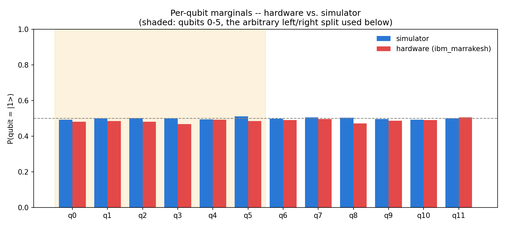
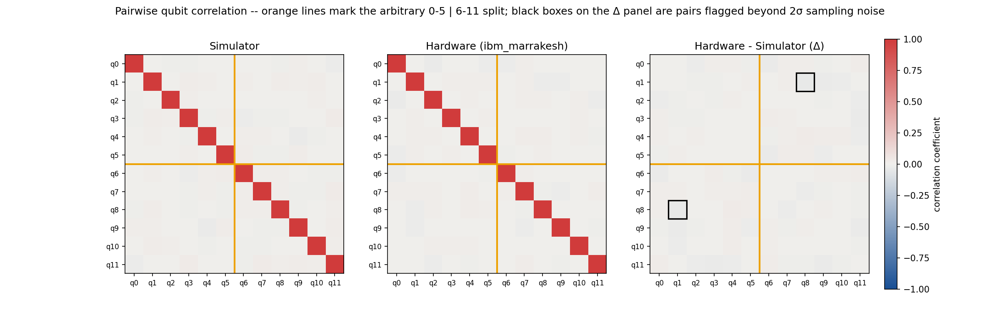
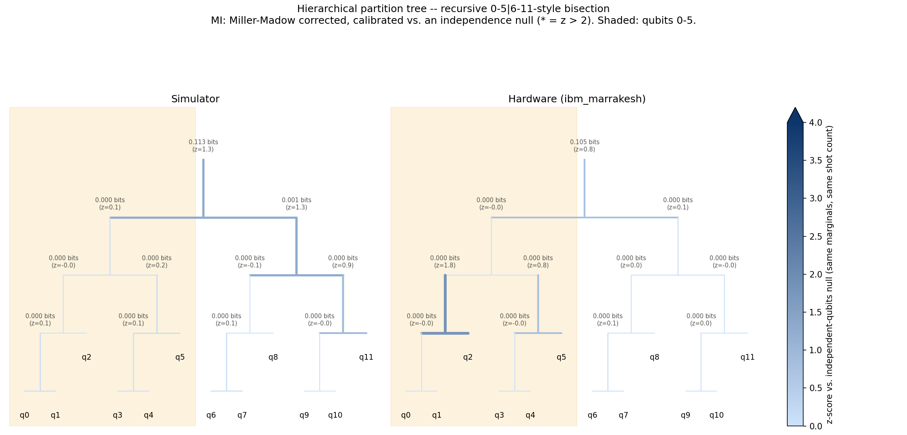

# Hierarchical qubit analysis -- quantum_radio 12-qubit run

Repurposes quantum_radio's 12-qubit hardware (ibm_marrakesh) vs. AerSimulator
counts to demonstrate a hierarchical qubit-correlation methodology. **The
qubits 0-5 | 6-11 split is an arbitrary bipartition, not a genuine encoding/
ancilla subspace** -- the golden-ratio phase-kick circuit this data comes from
has no such structure. Whether any flagged pair below is crosstalk noise or
something more structured isn't answerable from this data alone.

Generated by `qubit_hierarchy_analysis.py`. Source: `quantum_radio_results_12q.json`.

## Marginals

| Qubit | P(=1) sim | P(=1) hw | Δ |
|---|---:|---:|---:|
| q0 | 0.4934 | 0.4819 | -0.0115 |
| q1 | 0.5004 | 0.4843 | -0.0161 |
| q2 | 0.5013 | 0.4810 | -0.0204 |
| q3 | 0.5004 | 0.4683 | -0.0321 |
| q4 | 0.4941 | 0.4928 | -0.0013 |
| q5 | 0.5105 | 0.4854 | -0.0251 |
| q6 | 0.4991 | 0.4915 | -0.0077 |
| q7 | 0.5066 | 0.4956 | -0.0110 |
| q8 | 0.5048 | 0.4711 | -0.0337 |
| q9 | 0.4965 | 0.4878 | -0.0087 |
| q10 | 0.4927 | 0.4912 | -0.0015 |
| q11 | 0.4993 | 0.5049 | +0.0056 |

## Pairwise correlations

## Hierarchical partition tree

Edge weights are Miller-Madow bias-corrected mutual information (bits) between
each node's two halves, then calibrated against a *simulated independence null*:
200 synthetic datasets per node, drawn from independent Bernoulli qubits with that
node's own observed marginals and shot count, giving a z-score for "is this MI
bigger than independent qubits would produce by chance." That second step matters
-- the uncorrected plug-in estimator alone is a trap at the root: the full 12-qubit
joint has 4096 possible outcomes from only 8192 shots (N/K ~ 2), which produces ~0.3
bits of spurious "structure" on its own (naive root MI came out ~0.4 bits). Miller-
Madow correction brings that down to ~0.11 bits -- still, on its own, looking like
the biggest number in the tree by 20x. Only the null comparison resolves it: simulated
independent qubits with the *same* marginals and shot count produce MI in the same
~0.10 bit range purely from sampling noise, so the corrected root MI
(simulator=0.1134 bits, z=1.26; hardware=0.1055 bits,
z=0.79) is not distinguishable from noise. A node is only flagged
significant (marked `*` in the figure) at z > 2.

**Partition-tree nodes exceeding z > 2 (simulator or hardware):**

None. No qubit grouping at any level of the hierarchy -- including the top-level 0-5 | 6-11 split -- shows more mutual information than independent qubits with the same marginals would produce by chance. Combined with the near-zero pairwise correlation matrix, there's no evidence of structure here at any granularity: "noisy neighbors," not entanglement -- at least not at the level this circuit's measurement statistics can resolve it.

## Qubit pairs flagged beyond 2σ

2σ threshold on |hw correlation - sim correlation|, from the 8192-shot sampling
noise on each Pearson estimate (see docstring for the approximation): **0.0313**.

| Pair | Crosses 0-5|6-11? | sim corr | hw corr | Δ |
|---|---|---:|---:|---:|
| q1-q8 | yes | +0.0190 | -0.0175 | -0.0365 |
